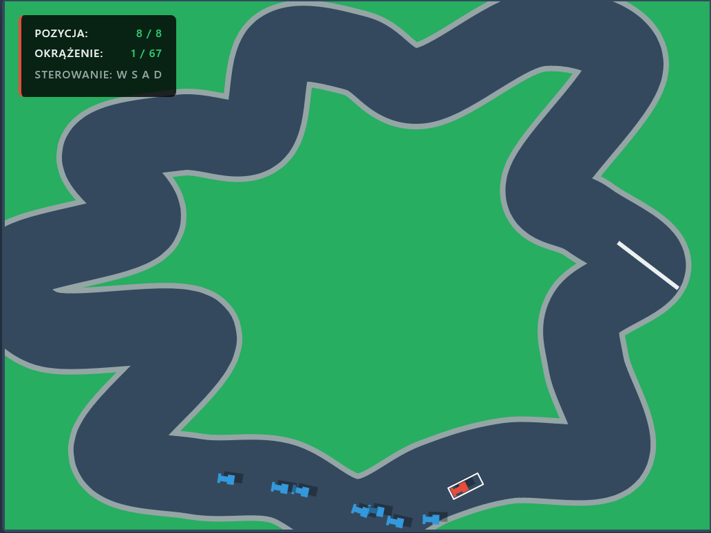

<div align="center">

# 🏎️ F1 Web Racer Pro
### Enterprise Edition


> Profesjonalny silnik wyścigowy 2D oparty na Canvas API, z proceduralnym generowaniem tras i reaktywnym AI.

[Demo Online (GitHub Pages)](https://ximeeek.github.io/F1-SIM/) · [Zgłoś Błąd](https://github.com/Ximeeek/F1-SIM/issues)

<br />



</div>

---

## 📋 O Projekcie

**F1 Web Racer Pro** to demonstracja inżynierii oprogramowania w kontekście GameDev. Projekt nie używa gotowych silników gier (Unity/Phaser), lecz implementuje własny silnik fizyczny i renderujący od zera, wykorzystując czysty JavaScript (ES2023+) i architekturę modułową.

### Kluczowe Funkcjonalności
* 🛣️ **Proceduralne Generowanie Tras** – Każdy wyścig to unikalny tor oparty na splajnach Catmull-Rom.
* 🤖 **Competitive AI** – Boty analizują krzywiznę zakrętów i planują tor jazdy (nie jadą "po sznurku").
* ⚛️ **Własny Silnik Fizyki** – Wektorowa obsługa kolizji, tarcia i pędu.
* ⚡ **Zero Dependencies** – Brak zewnętrznych bibliotek. Czysty kod.
* 🏗️ **Modular Architecture** – Kod podzielony na logiczne moduły ES (Entities, Core, Utils).

---

## 🚀 Quick Start

> ⚠️ **Ważne:** Projekt wykorzystuje **ES Modules**. Ze względu na politykę bezpieczeństwa CORS w przeglądarkach, nie można uruchomić pliku `index.html` bezpośrednio z dysku (`file://`). Wymagany jest lokalny serwer HTTP.

Wybierz jedną z poniższych metod uruchomienia:

### Opcja A: Visual Studio Code (Zalecane)
1. Zainstaluj rozszerzenie **Live Server**.
2. Kliknij prawym przyciskiem myszy na plik `index.html`.
3. Wybierz opcję **"Open with Live Server"**.

### Opcja B: Terminal (Node.js / Python)

Jeśli posiadasz Node.js:
```bash
npx http-server .

Jeśli posiadasz Python:
Bash

# Python 3.x
python -m http.server
```

🎮 Sterowanie
```
Klawisz	Akcja
W	Przyspieszenie (Gaz)
S	Hamowanie / Wsteczny
A	Skręt w lewo
D	Skręt w prawo
```
📂 Struktura Projektu
```
F1-SIM/
├── src/
│   ├── core/           # Pętla gry i zarządzanie stanem
│   ├── entities/       # Obiekty gry (Samochód, Tor)
│   ├── math/           # Biblioteka wektorowa (Vector2D)
│   └── utils/          # Konfiguracja i stałe
├── assets/             # Grafiki i zasoby
├── index.html          # Entry point
└── style.css           # Style interfejsu
```
🛠️ Konfiguracja

Wszystkie parametry symulacji znajdziesz w pliku src/utils/Config.js. Możesz łatwo dostosować rozgrywkę:
JavaScript
```
export const Config = {
    MAX_LAPS: 75,       // Liczba okrążeń
    CAR_COUNT: 8,       // Ilość bolidów na torze
    AI_LOOKAHEAD: 140,  // Zasięg widzenia botów (px)
    TOP_SPEED: 7.5      // Prędkość maksymalna
    // ...
};
```
<div align="center">

Developed with ❤️ by Ximeeek

</div>